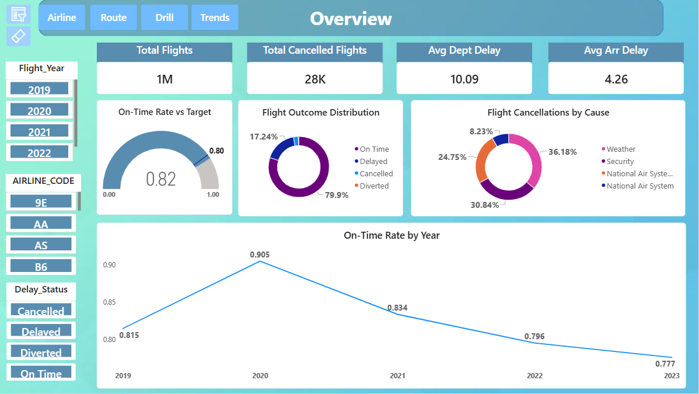
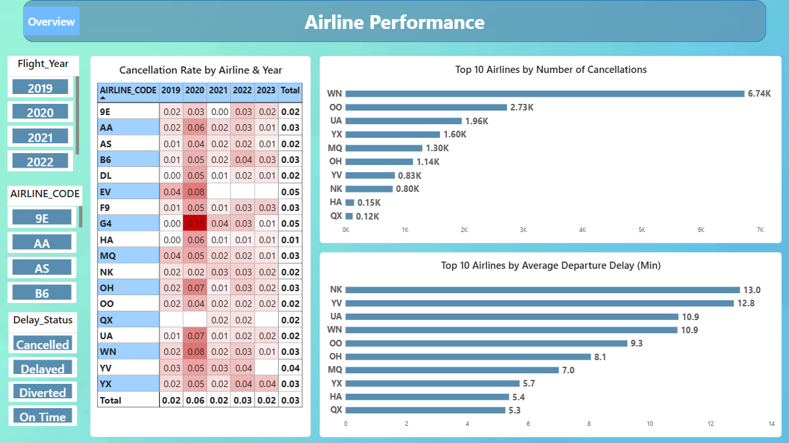
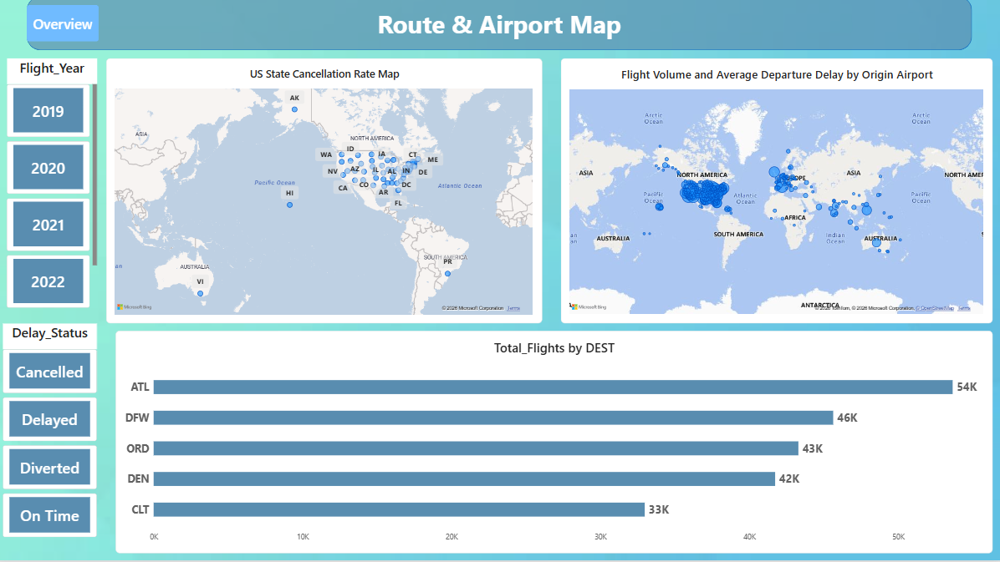
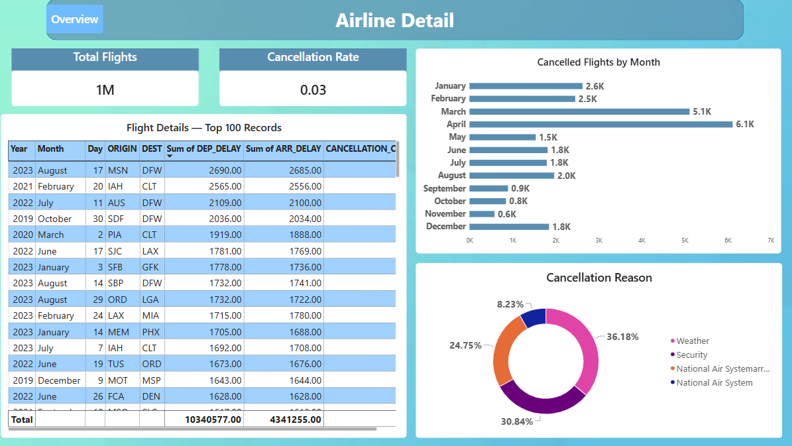
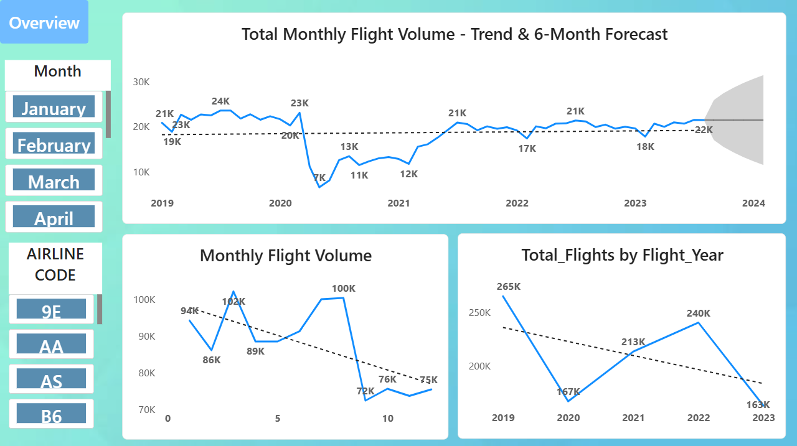

# ✈️ US Flight Performance & Operations Dashboard | Power BI

An interactive **Power BI dashboard** developed to analyze **US flight operations from 2019 to 2023**. The project provides a comprehensive view of flight volume, airline performance, cancellations, departure and arrival delays, on-time performance, airport activity, geographic distribution, and monthly flight trends.

The dashboard combines **DAX measures, Power Query transformations, interactive slicers, KPI cards, maps, conditional formatting, Top-N analysis, drill-through, drill-down, bookmarks, trend lines, and forecasting** to transform raw flight data into meaningful business insights.

---

## 📊 Dashboard Preview

The project contains five interactive Power BI report pages:

1. Overview
2. Airline Performance
3. Route & Airport Map
4. Airline Detail
5. Trends & Forecast

---

# 1️⃣ Overview Dashboard

The **Overview** page provides a high-level summary of the entire flight dataset using KPI cards and interactive visualizations.

### Key KPIs

- **Total Flights**
- **Total Cancelled Flights**
- **Average Departure Delay**
- **Average Arrival Delay**
- **On-Time Rate**

### Visualizations

- On-Time Rate vs Target Gauge
- Flight Outcome Distribution
- Flight Cancellations by Cause
- On-Time Rate by Year
- Interactive Flight Year slicer
- Airline slicer
- Delay Status slicer

### Purpose

This page acts as the main dashboard and provides a quick understanding of overall flight performance.

Users can interact with the slicers to dynamically analyze flight operations by:

- Year
- Airline
- Delay Status

---

# 2️⃣ Airline Performance Dashboard

The **Airline Performance** page focuses on comparing airlines and identifying differences in cancellation and delay performance.

### Key Visualizations

#### Cancellation Rate by Airline & Year

A matrix displays cancellation rates for individual airlines across different years.

Conditional formatting is applied to highlight differences in performance.

Higher cancellation rates are represented using stronger red shading.

#### Top 10 Airlines by Number of Cancellations

A clustered bar chart ranks the top 10 airlines based on the number of cancelled flights.

This helps identify airlines with the highest cancellation volumes.

#### Top 10 Airlines by Average Departure Delay

Another clustered bar chart ranks airlines according to their average departure delay.

This provides a comparison of operational delay performance.

### Interactive Features

- Flight Year slicer
- Airline slicer
- Delay Status slicer
- Top-N filtering
- Matrix conditional formatting

### Purpose

This page helps compare airline performance and identify airlines experiencing higher cancellation or delay levels.

---

# 3️⃣ Route & Airport Map

The **Route & Airport Map** page provides geographic analysis of flight operations.

### Key Visualizations

#### US State Cancellation Rate Map

A filled map displays cancellation rates across US states.

Darker areas indicate higher cancellation rates.

#### Flight Volume and Average Departure Delay by Origin Airport

The bubble map displays origin airports geographically.

The visual represents:

- **Bubble size** → Flight volume
- **Bubble colour/intensity** → Average departure delay

Larger bubbles represent airports with higher flight activity.

#### Total Flights by Destination

A bar chart displays the destinations with the highest number of flights.

### Interactive Filters

- Flight Year
- Delay Status

### Purpose

This page helps identify geographic patterns in flight operations, high-volume airports, and locations associated with higher cancellation or delay levels.

---

# 4️⃣ Airline Detail — Drill-Through

The **Airline Detail** page provides a detailed view of an individual airline using Power BI Drill-Through functionality.

### Key Components

#### Total Flights KPI

Displays the total number of flights for the selected airline.

#### Cancellation Rate KPI

Displays the cancellation rate for the selected airline.

#### Cancelled Flights by Month

A bar chart shows monthly cancellation patterns.

This allows users to identify months with higher cancellation activity.

#### Cancellation Reason

A donut chart displays the distribution of cancellation causes.

#### Flight Details Table

The table provides detailed flight-level information including:

- Flight Date
- Origin
- Destination
- Departure Delay
- Arrival Delay
- Cancellation Code

### Drill-Through Workflow

Users can:

1. Go to the Airline Performance page.
2. Select an airline from the relevant visual.
3. Right-click the airline.
4. Select **Drill Through**.
5. Navigate to the Airline Detail page.
6. Analyze airline-specific information.

### Purpose

The drill-through page allows users to move from high-level airline performance analysis to detailed airline-level information.

---

# 5️⃣ Trends & Forecast

The **Trends & Forecast** page focuses on historical flight-volume patterns and future projections.

### Key Visualizations

#### Total Monthly Flight Volume — Trend & 6-Month Forecast

A line chart displays historical monthly flight volume along with:

- Trend line
- Forecast
- Confidence interval

The visual helps identify changes in flight activity over time.

#### Monthly Flight Volume

Displays monthly flight volume across the selected period.

#### Total Flights by Flight Year

Shows yearly flight volume and makes it easier to compare changes between years.

### Key Analysis

The trend analysis helps highlight:

- Changes in flight activity
- COVID-19 period disruption
- Recovery after the disruption
- Monthly variations
- Long-term flight-volume patterns
- Future flight-volume projections

---

# 🎯 Project Objectives

The main objectives of this Power BI project are to:

- Analyze overall US flight activity.
- Measure airline performance.
- Identify airlines with high cancellation volumes.
- Analyze departure and arrival delays.
- Measure on-time flight performance.
- Understand major cancellation causes.
- Identify high-volume airports.
- Analyze yearly and monthly flight trends.
- Compare airline performance across different years.
- Analyze geographic patterns in flight operations.
- Provide detailed airline-level analysis through Drill-Through.
- Identify historical trends.
- Forecast future flight volume.

---

# 📌 Key KPIs

The dashboard contains six major DAX measures.

| KPI | Description |
|---|---|
| **Total Flights** | Total number of flight records in the current filter context |
| **Total Cancelled Flights** | Number of cancelled flights |
| **Cancellation Rate** | Percentage of flights that were cancelled |
| **Average Departure Delay** | Average departure delay for operated flights |
| **Average Arrival Delay** | Average arrival delay for operated flights |
| **On-Time Rate** | Percentage of eligible operated flights arriving within the defined on-time threshold |

---
# 👩‍💻 Author

### Mansi Pawar

**Data Analytics & Power BI Enthusiast**

This project was designed and developed by **Mansi Pawar** as a practical Business Intelligence and Data Analytics project using Microsoft Power BI.

### 🛠️ Technical Skills

`Power BI` • `DAX` • `Power Query` • `Data Analytics` • `Data Visualization` • `Dashboard Design` • `SQL` • `Microsoft Excel`

### 📌 Project Focus

- Business Intelligence
- Data Analysis
- Interactive Dashboard Development
- Data Visualization
- KPI & Performance Analysis
- Trend & Forecast Analysis

---

⭐ **If you found this project useful, please consider giving this repository a star!**

